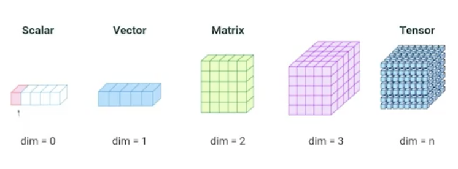
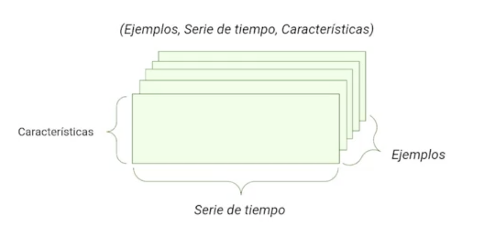
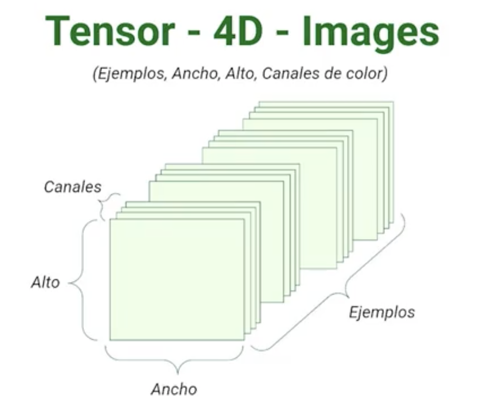

# NumPy y Pandas

* NumPy libreria para el calculo númerico y manejo de arrays o listas organizadas de numeros.
* Pandas librería orientada a la manipulación y analisis de dataos.

**NumPy**
nace en el 2005, 100% opensource  su creador es Travis Oliphant

¿Por que usar Numpy en la ciencia de datos?
* Su valocidad: es hasta 50 veces más rapido que usar listas propia de python
* Tamaño: optiomiza mucho el almacenamiento en memoria
* maneja muchos tipos de datos
* es muy poderoza, se puede hasta crear redes neuronales

**Pandas**
Creada en 2008 Construida sobre numpy, fue creada por Wes McKinney

¿Por que usar Pandas?
* Velocidad: hereda las bondades de numpy
* Poco código: Se necesita poco código para manipular distintos tipos de datos.
* Múltiples formatos de archivos
* Alineación inteligente
* Muy poderosa

La forma de importar estas librerías

```python
import numpy as np
import pandas as pd
```


## Referencias 
*  [NumPy](https://numpy.org/)
* [Getting started — pandas 1.4.1 documentation](https://pandas.pydata.org/docs/getting_started/index.html)
* [GitHub - numpy/numpy](https://github.com/numpy/numpy)
* [GitHub - pandas-dev/pandas](https://github.com/pandas-dev/pandas)

# Numpy

```sh
    pip install numpy
```

## Array
Es la estructura central de Numpy.

Tiene una estructura indexada (contiene encabezados que ayuda a identificar los objetos del mismo).

También puede almacenar una cantidad enorme de datos y los podemos acceder de forma individual y grupal.


Si bien es muy parecido a manejar una lista común de python es hasta 50 veces más rápido que estas y va a ocupar mucho menos memoria.

```python
import numpy as np

lista = np.array([1,2,3])
matriz = np.array([[1,2,3],[3,4,5],[6,7,8]])
```

Slicing: proceso por el cual voy a seleccionar un grupo de a generar un subgrupo de valores del array.

```python
lista = np.array([1,2,3,4,5,6,7,8,9])

print(lista[1:5]) #[2 3 4 5]
print(lista[1:5]) #[1 2 3 4 5]
print(lista[2:])  #[3 4 5 6 7 8 9]
print(lista[::2]) #[1 3 5 7 9]
print(lista[-1])  #9
```

Veamos algunos métodos de Numpy para crear arrays

```python
print(np.arange(0,10)) # crea un array de con de 10 valores
print(np.arange(0,10,2)) # crea un array hasta el valor 10, saltando sus valores de 2 en 2
print(np.zeros(3)) # se utiliza para crear un estructura inicial, crea un array cuyos elementos están compuesto por 0
print(np.ones(3)) # se utiliza para crear un estructura inicial, crea un array cuyos elementos están compuesto por 1
print(np.linspace(0,10,10)) # valor de inicio, valor de fin, cuantos datos quiero generar
print(np.eye(4)) # crea una matriz con la diagonal principal en 1 y el resto en 0
print(np.random.rand(4)) # crea una estructura con valores aleatorios, con valores entre 0 y 1
print(np.random.randint(1,14)) # retorna valor random entre 1 y 14
print(np.random.randint(1,14,(10,10))) # retorna una matriz 10x10 con valores aleatorios entre 1 y 14
```

## Tipos de datos

Con el atributo `dtype` podemos ver los tipos de datos que conforman un array.

Cuando creamos un arreglo, podemos pasarle a la función `array` el tipo de datos que queremos que contenga mediante el parámetro `dtype`.

Por último con la función `astype` podremos cambiar el tipo de dato de nuestra colección.

```python
matriz = np.array([[1,2,3],[3,4,5],[6,7,8]])
print('Tipos de datos que contiene la matriz ', matriz.dtype)
print('Creamos un array y le asignamos un tipo a los datos que contendra ', np.array([1,2,3], dtype='float64'))
print('Modificamos el tipo de datos al tipo floar64 ', matriz.astype(np.float64))
```

[Link a la documentación de los tipos de datos de Numpy.](https://numpy.org/doc/stable/user/basics.types.html)

## Dimensiones

Tenemos 4 clasificaciones de dimensiones

* scalar: dim = 0 Un solo dato o valor
* vector: dim = 1 Listas de Python
* matriz: dim = 2 Hoja de cálculo
* tensor: dim > 3 Series de tiempo o Imágenes



### 2 Dimenciones

Cuando trabajamos en 2 dimensiones las:
* Filas: representan los ejemplos (cantidad de ejemplos) 
* Columnas: representa las características

### 3 Dimenciones
Cuando agregamos una tercera dimensión la misma en la mayoría de los casos representa una serie de tiempo.



### 4 Dimenciones
Cuando agregamos una cuarta dimensión la misma representa canales.



### **Ejemplos**

```python
# con la propiedad ndim podemos ver la cantidad de dimensiones
print('scalar', np.array(42).ndim)
print('vector', np.array([1,2,3]).ndim)
print('matris', np.array([[1,2,3],[4,3,2]]).ndim)
print('tensor', np.array([[[1,2,3],[4,3,2]],[[1,2,3],[4,3,2]]]).ndim)

'''
    agregar y eliminar dimensiones
'''
vector = np.array([1,2,3], ndmin=10) # Creamos una colección de 10 dimensiones

# con el método np.expand_dims aumentamos la cantidad de dimensiones
        
expand = np.expand_dims(np.array([1,2,3]),axis=0) # axis sus valores representan: 0 - filas ; 1 - columnas 


print(vector, vector.ndim)
vector2 = np.squeeze(vector) # squeeze elimina las dimensiones vacías
print(vector2, vector2.ndim)
```

## Shape y Reshape

Son 2 funciones que nos permiten saber el formato de mi arreglo (shape) y transformar la estructura de mi arreglo en otra (reshape) mientras mantenga la cantidad de elementos.

```python
arr = np.random.randint(0,10,(3,2))
print(arr.shape) # indica la forma del arreglo.
print(arr.reshape(1,6)) # transforma el arreglo mientras se mantengan los elementos.
print(arr.reshape(2,3))
print(np.reshape(arr, (2,3)) )
print(np.reshape(arr, (2,3)),'C') # se puede hacer un reshape como lo haría C.
print(np.reshape(arr, (2,3)),'F') # también se puede hacer reshape a como lo haría Fortran.
print(np.reshape(arr, (2,3)),'A') # además, existe la opción de hacer reshape según como esté optimizado nuestro computador. En este caso es como en C.
```

## Funciones principales de NumPy


**funciones útiles**

```python
arr = np.random.randint(1,20,10)
matriz = np.reshape(arr, (2,5))
print("max - ", matriz.max()) # me trae el valor más grande de mi arreglo 
print("max(1) - ", matriz.max(1)) # puedo especificar el eje, 0 - es por columna; 1 - es por fila 
print("argmax - ", matriz.argmax()) # me muestra el índice del valor más grande 
print("argmax - ", matriz.argmax(1)) # me muestra el índice del valor más grande por columna o fila 
print("min - ", matriz.min()) # me trae el valor más chico de mi arreglo - tiene el mismo comportamiento que el max

print("ptp - ", matriz.ptp()) # muestra la diferencia que tenemos entre el pico más bajo y el pico más alto 
print("ptp - ", matriz.ptp(0)) # podemos pedir lo mismo pero por 0 - es por columna; 1 - es por fila
print("sort - ", np.sort(matriz)) 

# concatenate
a = np.array([(1,2),(3,4)]) 
b = np.array([(5,6),(7,8)]) 
print(np.concatenate((a,b), axis=0))
```

**funciones estadísticas**

```python
arr = np.random.randint(1,20,10)
matriz = np.reshape(arr, (2,5))

print("percentile - ", np.percentile(matriz, 50)) 
print("median - ", np.median(matriz)) 
print("std - ", np.std(matriz)) # desviación estándar 
print("var - ", np.var(matriz)) # varianza 
print("mean - ", np.mean(matriz)) # media
```