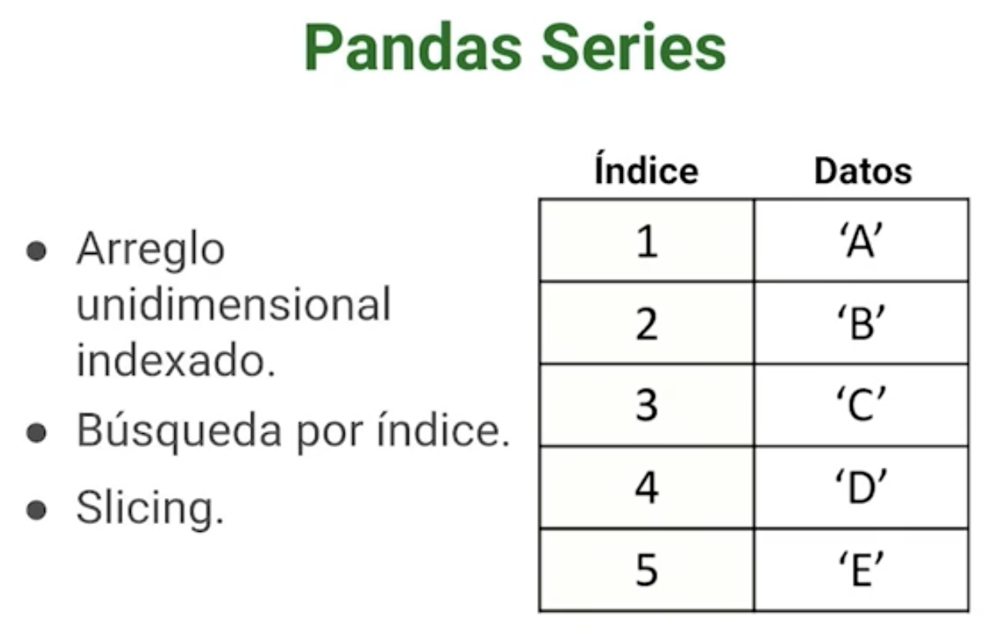
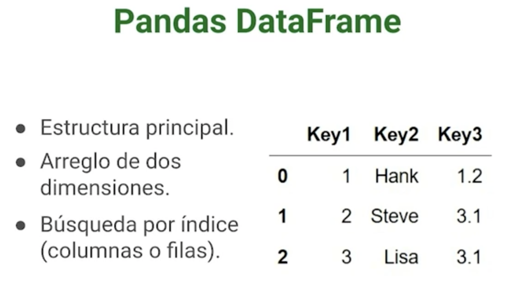

# Pandas

Creada en 2008 Construida sobre numpy, fue creada por Wes McKinney

¿Por que usar Pandas?
* Velocidad: hereda las bondades de numpy
* Poco código: Se necesita poco código para manipular distintos tipos de datos.
* Múltiples formatos de archivos
* Alineación inteligente
* Muy poderosa

## Referencias 
* [GitHub - pandas-dev/pandas](https://github.com/pandas-dev/pandas)

## Instalación

```sh
    pip install pandas
```
## Import básico

```python
import pandas as pd
```

## Series y DataFrames

### Pandas Series
Es muy similar a un array unidimensional y es:

* Arreglo unidimensional indexado.
* Búsqueda por índice.
* Permite hacer Slicing.
* Soporta muchas operaciones matemáticas.
* Soporta muchos tipos de datos.



```python
    # Creamos una serie
    psg_players = pd.Series(['Navas', 'Mbappe','Neymar','Messu'])
    # Creamos una serie y personalizamos el índice
    psg_players_custom_index = pd.Series(['Navas', 'Mbappe','Neymar','Messu'],
            index=[1,7,10,30])
    # Creamos una serie a partir de un diccionario
    dict = {1:'Navas', 7:'Mbappe',10:'Neymar',30:'Messu'}
    psg_players = pd.Series(dict))
```

## Pandas DataFrame
Son parecidos a las estructuras matriciales:

* Es la estructura principal
* Es un arreglo de 2 dimensiones.
* Búsqueda por índice (columna o fila).
* Permite hacer Slicing.
* Soporta muchas operaciones matemáticas.
* Soporta muchos tipos de datos.
* Es de tamaño variable.
* Optimiza el consumo de memoria.



```python
    dict = {'jugador':['Navas', 'Mbappe','Neymar','Messu'],
    'altura':[183.0,170.0,170.2,165.0],
    'goles':[2,200,230,500]
    }
    # creamos un dataframe con índices personalizados
    df_players = pd.DataFrame(dict, index=[1,7,10,30])
    # accedemos a un valor del data frame mediante el par columna - index
    print(print(df_players['jugador'][7]))
    
```
## Leer archivos CSV y JSON con Pandas

```python
# CSV
def read_csv():    
    df_csv = pd.read_csv('./librerias/pandas/bestsellers-with-categories.csv',
                         sep=',',
                         header=0, # None se utiliza cuando nuestro csv no tiene header
                         names=['Name', 'Author', 'User Rating', 'Reviews', 'Price', 'Year', 'Genre'] # puedo cambiar el valor de los headers
                         )  
    return df_csv

# JSON
def read_json():
    df_json = pd.read_json('./librerias/pandas/hpcharactersdataraw.json',
                           typ='Series')
    return df_json
```

## Filtrado con loc y iloc

Cuando queremos **navegar** por un dataFrame estas funciones permiten filtrar datos de manera más específica

```python
df = read_csv()
# forma normal de obtener datos
print(df[0:4])
print(df['Name'])
print(df[['Name','Author', 'Year']])

# Loc - funciona por label
df.loc[0:4] # incluye la posicion 4
df.loc[0:4, ['Name','Author', 'Year']] # filtro por label
print(df.loc[:, ['Reviews']] * -1) # retorna el resultado de reviews multiplicado por -1
print(df.loc[:, ['Author']] == 'JJ Smith') # retorna el resultado de la comparación de si el autor es == a JJ Smith

# iLoc -- funciona por índice
print(df.iloc[:,0:3]) # trae solo las 3 columnas
print(df.iloc[:2,2:]) # trae las 2 primeras filas y de la segunda columna a la última```

```

## Agregar o eliminar datos

Muchas ocasiones necesitamos agregar, eliminar o separar datos y pandas nos ofrece varias funciones para que este proceso se vuelva mucho más sencillo.

```python
def add_data():
    df = read_csv()
    print(df.head(2)) # Limitó a que solo me traiga 2 filas

    df['Nueva columna'] = np.nan
    print(df.head(2))
    print(df.shape[0]) # Indica la cantidad de filas que tenemos
    data = np.arange(0, df.shape[0]) # Se crea ana lista con valores desde 0 a la cantidad de filas
    df['Rango'] = data
    print(df.head(2))


def remove_data():
    df = read_csv()
    print(df.head(2)) # Limitó a que solo me traiga 2 filas
    
    # Eliminar Columnas
    print(df.drop('Genre', axis=1).head(2)) # Eliminó la columna Gener, se utiliza el axis para indicar que el drop es por columna.
    df.drop('Genre', axis=1, inplace=True) # inplace: su valor por defecto es false. Con inplace en true indicamos que queremos que elimine la columna del dataset, con el valor de inplace en false solo lo elimina en la salida.
    print(df.head(2)) 
    df.drop(0, axis=0, inplace=True) # Eliminó la fila 0
    print(df.head(2)) 
    df.drop([1,2], axis=0, inplace=True) # Eliminó la fila 1,2
    print(df.head(2)) 
```

## Manejo de datos nulos

Los datos nulos son dolores de cabeza para este mundo de la ciencia de datos y se van a encontrar mucho en nuestros DataFrames.

```python
def manejo_nulos():
    dict = {'col1':[1,2,3,np.nan],
            'col2':[4,np.nan,6,8],
            'col3':['a','b','c',np.nan]}
    df = pd.DataFrame(dict)
    print(df)
    print(df.isnull()) # me que valor de data frame es null
    print(df.isnull() * 1) # convierte los false en o y los true en 1 
    print(df.fillna('Missing')) # cambia los nulos por el valor que ingresamos
    print(df.interpolate()) # hace una interpolación de una serie y da un valor que el calcula, solo sirve para valores numéricos y es útil cuando nuestros datos siguen una estructura de una serie
    print(df.dropna()) # elimino los datos en null
```