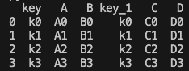
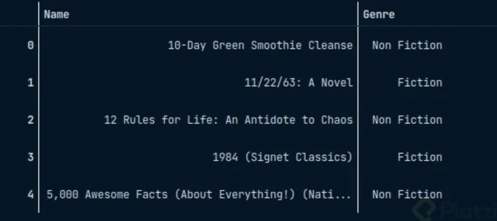

# Pandas

Creada en 2008 Construida sobre numpy, fue creada por Wes McKinney

¿Por que usar Pandas?
* Velocidad: hereda las bondades de numpy
* Poco código: Se necesita poco código para manipular distintos tipos de datos.
* Múltiples formatos de archivos
* Alineación inteligente
* Muy poderosa

## Referencias 
* [GitHub - pandas-dev/pandas](https://github.com/pandas-dev/pandas)
* [10 minutes to pandas](https://pandas.pydata.org/docs/user_guide/10min.html)

## Instalación

```sh
    pip install pandas
```
## Import básico

```python
import pandas as pd
```

## Series y DataFrames

### Pandas Series
Es muy similar a un array unidimensional y es:

* Arreglo unidimensional indexado.
* Búsqueda por índice.
* Permite hacer Slicing.
* Soporta muchas operaciones matemáticas.
* Soporta muchos tipos de datos.


```python
    # Creamos una serie
    psg_players = pd.Series(['Navas', 'Mbappe','Neymar','Messu'])
    # Creamos una serie y personalizamos el índice
    psg_players_custom_index = pd.Series(['Navas', 'Mbappe','Neymar','Messu'],
            index=[1,7,10,30])
    # Creamos una serie a partir de un diccionario
    dict = {1:'Navas', 7:'Mbappe',10:'Neymar',30:'Messu'}
    psg_players = pd.Series(dict))
```

## Pandas DataFrame
Son parecidos a las estructuras matriciales:

* Es la estructura principal
* Es un arreglo de 2 dimensiones.
* Búsqueda por índice (columna o fila).
* Permite hacer Slicing.
* Soporta muchas operaciones matemáticas.
* Soporta muchos tipos de datos.
* Es de tamaño variable.
* Optimiza el consumo de memoria.


```python
    dict = {'jugador':['Navas', 'Mbappe','Neymar','Messu'],
    'altura':[183.0,170.0,170.2,165.0],
    'goles':[2,200,230,500]
    }
    # creamos un dataframe con índices personalizados
    df_players = pd.DataFrame(dict, index=[1,7,10,30])
    # accedemos a un valor del data frame mediante el par columna - index
    print(print(df_players['jugador'][7]))
    
```
## Leer archivos CSV y JSON con Pandas

```python
# CSV
def read_csv():    
    df_csv = pd.read_csv('./librerias/pandas/bestsellers-with-categories.csv',
                         sep=',',
                         header=0, # None se utiliza cuando nuestro csv no tiene header
                         names=['Name', 'Author', 'User Rating', 'Reviews', 'Price', 'Year', 'Genre'] # puedo cambiar el valor de los headers
                         )  
    return df_csv

# JSON
def read_json():
    df_json = pd.read_json('./librerias/pandas/hpcharactersdataraw.json',
                           typ='Series')
    return df_json
```

## Filtrado con loc y iloc

Cuando queremos **navegar** por un dataFrame estas funciones permiten filtrar datos de manera más específica

```python
df = read_csv()
# forma normal de obtener datos
print(df[0:4])
print(df['Name'])
print(df[['Name','Author', 'Year']])

# Loc - funciona por label
df.loc[0:4] # incluye la posicion 4
df.loc[0:4, ['Name','Author', 'Year']] # filtro por label
print(df.loc[:, ['Reviews']] * -1) # retorna el resultado de reviews multiplicado por -1
print(df.loc[:, ['Author']] == 'JJ Smith') # retorna el resultado de la comparación de si el autor es == a JJ Smith

# iLoc -- funciona por índice
print(df.iloc[:,0:3]) # trae solo las 3 columnas
print(df.iloc[:2,2:]) # trae las 2 primeras filas y de la segunda columna a la última```

```

## Agregar o eliminar datos

Muchas ocasiones necesitamos agregar, eliminar o separar datos y pandas nos ofrece varias funciones para que este proceso se vuelva mucho más sencillo.

```python
def add_data():
    df = read_csv()
    print(df.head(2)) # Limitó a que solo me traiga 2 filas

    df['Nueva columna'] = np.nan
    print(df.head(2))
    print(df.shape[0]) # Indica la cantidad de filas que tenemos
    data = np.arange(0, df.shape[0]) # Se crea ana lista con valores desde 0 a la cantidad de filas
    df['Rango'] = data
    print(df.head(2))


def remove_data():
    df = read_csv()
    print(df.head(2)) # Limitó a que solo me traiga 2 filas
    
    # Eliminar Columnas
    print(df.drop('Genre', axis=1).head(2)) # Eliminó la columna Gener, se utiliza el axis para indicar que el drop es por columna.
    df.drop('Genre', axis=1, inplace=True) # inplace: su valor por defecto es false. Con inplace en true indicamos que queremos que elimine la columna del dataset, con el valor de inplace en false solo lo elimina en la salida.
    print(df.head(2)) 
    df.drop(0, axis=0, inplace=True) # Eliminó la fila 0
    print(df.head(2)) 
    df.drop([1,2], axis=0, inplace=True) # Eliminó la fila 1,2
    print(df.head(2)) 
```

## Manejo de datos nulos

Los datos nulos son dolores de cabeza para este mundo de la ciencia de datos y se van a encontrar mucho en nuestros DataFrames.

```python
def manejo_nulos():
    dict = {'col1':[1,2,3,np.nan],
            'col2':[4,np.nan,6,8],
            'col3':['a','b','c',np.nan]}
    df = pd.DataFrame(dict)
    print(df)
    print(df.isnull()) # Me que valor de data frame es null.
    print(df.isnull() * 1) # Convierte los false en o y los true en 1.
    print(df.fillna('Missing')) # Cambia los nulos por el valor que ingresamos.
    print(df.interpolate()) # Hace una interpolación de una serie y da un valor que el calcula, solo sirve para valores numéricos y es útil cuando nuestros datos siguen una estructura de una serie.
    print(df.dropna()) # Elimino los datos en null.
```

## Funciones principales de pandas

```python
    df = read_csv()
    print(df.info()) # Nos proporciona data importante de nuestro dataset, como el nombre de nuestras columnas, la cantidad de null por columna, el tipo de datos y su indice.
    print(df.describe()) # De las columnas numéricas nos van a dar algunos datos estadísticos.
    print(df.tail()) # Muestra los últimos 5 registros.
    print(df.memory_usage(deep=True)) # Me dice cuanta memoria estamos usando en el dataset.
    print(df['Author'].value_counts()) # Muestra cuántos datos hay de cada autor.
    print(df.drop_duplicates()) # Elimina las filas duplicadas.
    print(df.drop_duplicates(keep='last')) # Elimina las filas duplicadas menos el ultimo.
    print(df.sort_values('Year')) # Ordena los valores de menor a mayor según el año.
    print(df.sort_values('Year', ascending=False)) # Ordena los valores de mayor a menor según el año.
```

## Groupby

Groupby es un método del dataFrama que nos permite realizar diversos cálculos agrupados por alguna columna.


```python
def groupby():
    df = read_csv()
    print(df.groupby('Author').count()) # Agrupar por Author y mostrar el conteo de los datos de las demás columnas. 
    print(df.groupby(['Author','Year']).count()) # Agrupo por 2 columnas. 
    print(df.groupby('Author').count().reset_index()) # Vuelvo a dejar la columna de Author como una columna. 
    print(df.groupby('Author').sum().loc['William Davis']) # Del resultado de la agrupación, filtro por el Author WIlliam Davis. 
    print(df.groupby('Author').agg(['min','max'])) # Agrupado por Author, pido los máximos y mínimos. 
    print(df.groupby('Author').agg({'Reviews':['min','max'], 'User Rating':'sum'})) # Agrupado por author, pedimos los mínimos y máximos de las reviews y la suma del rating del usuario. 

```

## Combinando DataFrames

### Concat


```python
 df1 = pd.DataFrame({
        'A':['A0','A1','A2','A3'],
        'B':['B0','B1','B2','B3'],
        'C':['C0','C1','C2','C3'],
        'D':['D0','D1','D2','D3'],
    })
    df2 = pd.DataFrame({
        'A':['A4','A5','A6','A7'],
        'B':['B4','B5','B6','B7'],
        'C':['C4','C5','C6','C7'],
        'D':['D4','D5','D6','D7'],
    })
    print(pd.concat([df1,df2], ignore_index=True)) # Concatenamos por fila. Con ignore_index me reorganiza los índice.
```


```python
    print(pd.concat([df1,df2], axis=1)) # Concatenamos por columna.
```


### merge

```python
    izq = pd.DataFrame({'key' : ['k0', 'k1', 'k2','k3'],
                        'A' : ['A0', 'A1', 'A2','A3'],
                        'B': ['B0', 'B1', 'B2','B3']})

    der = pd.DataFrame({'key' : ['k0', 'k1', 'k2','k3'],
                        'C' : ['C0', 'C1', 'C2','C3'],
                        'D': ['D0', 'D1', 'D2','D3']})
    
    
    print(izq.merge(der, on='key'))
```


```python

    der = pd.DataFrame({'key_1' : ['k0', 'k1', 'k2','k3'],
                        'C' : ['C0', 'C1', 'C2','C3'],
                        'D': ['D0', 'D1', 'D2','D3']})
    
    print(izq.merge(der, left_on='key', right_on='key_1'))

```



### join

Join es otra herramienta para hacer exactamente lo mismo, una combinación. La diferencia es que join va a ir a los índices y no a columnas específicas.

```python
    izq = pd.DataFrame({
                        'A': ['A0','A1','A2'],
                        'B':['B0','B1','B2']
                        },
                        index=['k0','k1','k2'])

    der =pd.DataFrame({
                        'C': ['C0','C1','C2'],
                        'D':['D0','D1','D2']
                      },
                        index=['k0','k2','k3']) 

    print(izq.join(der))
    
```


```python
print(izq.join(der, how='inner')) # Con how podemos especificar las diferentes formar de join.
```


## pivot_table

Básicamente, transforma los valores de determinadas columnas o filas en los índices de un nuevo DataFrame, y la intersección de estos es el valor resultante.

```python
    df_books = read_csv()
    df_books.pivot_table(index='Author',columns='Genre',values='User Rating')
```

Como resultado, los valores de Author pasan a formar el índice por fila y los valores de Genre pasan a formar parte de los índices por columna, y el User Rating se mantiene como valor.

pasamos de 


a


## melt

El método melt toma las columnas del DataFrame y las pasa a filas, con dos nuevas columnas para especificar la antigua columna y el valor que traía.

```python
    df_books = read_csv()
    df_books[['Name','Genre']].head(5)
```




```python
    df_books = read_csv()
    df_books.pivot_table(index='Author',columns='Genre',values='User Rating')
```


Ahora cada resultado de las dos columnas pasa a una fila de este modo a tipo **llave:valor**.

## Apply

**Apply** Es un comando muy poderoso que nos deja aplicar funciones a nuestro DataFrame.

> Es un mecanismo mucho más rapido que utilizar un for.

```python
def two_times(value):
    return value * 2

def apply():
    df = read_csv()
    print(df['User Rating'].head(2))
    print(df['User Rating'].head(2).apply(two_times)) # Le aplicó al valor de User Rating la lógica de la función two_times.

    df['User Rating2'] = df['User Rating'].head(2).apply(two_times)
    print(df)
    
    print(df['User Rating'].head(2).apply(lambda x : x * 3))

    print(df.apply(lambda x : x['User Rating'] * 2 if x['Genre'] == 'Fiction' else x['User Rating'], axis=1) )
    # Le agregamos condicionales para aplicar la lógica de forma más inteligente
```