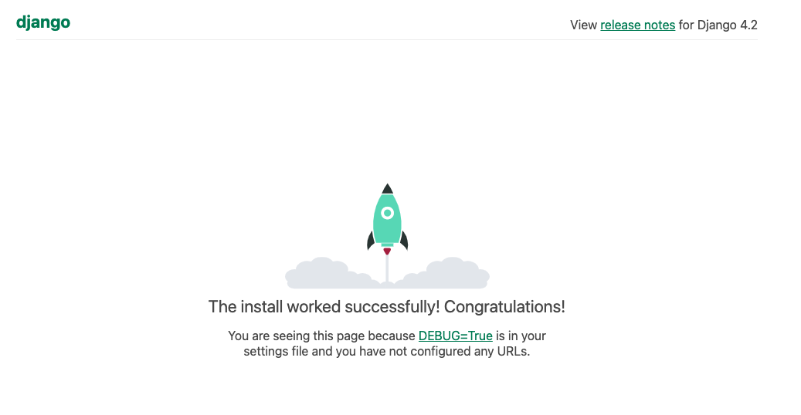

# Django

Es un framework que nos ayuda a crear aplicaciones web.

## Referencia
* [generic views doc](https://ccbv.co.uk/)

**Características de Django:**
* Es rápido, no es el más rápido pero si está entre los más rapido de python
* Seguro
* Es un framework escalable

## Requisitos

```sh
    pip install django
```

## Primeros pasos

Lo primero que tenemos que hacer es crear nuestro proyecto utilizando django con el comando

```sh
    django-admin startproject <nombre del proyecto>
```

Al finalizar la ejecución del comando, Django nos habrá creado la estructura básica de nuestra aplicación.

* una carpeta con el nombre del proyecto
    * __init__.py: archivo clasico de python que nos indica que estamos dentro de un paquete
    * asgi.py: nos ayuda a realizar el deploy 
    * settings.py: Contiene toda la información de la configuración de nuestro proyecto
    * urls.py: Es el archivo donde vamos a colocar las url de nuestro proyecto.
    * wsgi.py: nos ayuda a realizar el deploy 
* manage.py: se ubica en la carpeta raiz donde corrimos el comando `startproject`

Creado nuestro proyecto, vamos a comprobar que todo esté funcionando de forma correcta iniciando nuestro server de Django con el siguiente comando

```sh
    python3.10 manage.py runserver
```

tras correr el comando vamos a entrar a **localhost:8000** con algún browser y sí todo salió bien tendríamos que ver una página similar a la siguiente



> el puerto 8000 nos fue indicado por django cuando iniciamos el server con el mensaje --> Starting development server at http://127.0.0.1:8000/


### proyectos vs apps

Django maneja los términos proyecto y apps como 2 cosas distintas, siendo un **proyecto** un conjunto de apps y una **app* un módulo dentro de un proyecto el cual sí lo definimos de forma correcta es una pieza de código que podremos reutilizar en cualquier proyecto.

**Forma de crear una app**

```sh
    python3.10 manage.py startapp polls
```

Estructura de archivos de nuestra app

* __init__.py
* admin.py
* apps.py
* models.py
* test.py
* view.py
* urls.py: Esté archivo no lo crea el comando ejecutado, pero es conveniente que lo creemos de forma manual sí nuestra app va a manejar componentes visuales


Llegado a este punto ya tenemos creado nuestro primer proyecto y le hemos creado al mismo su primer app. Es hora de que creemos nuestro primer `hola mundo`, el cual lo haremos en la app creara.

Para esto tenemos que hacer 2 cosas:
* Crear nuestra función que nos retorne nuestro mensaje
* Exponer nuestra url

Vamos a nuestro archivo `polls/views.py` para crear nuestra función

```python
from django.shortcuts import render

# importamos HttpResponse para poder manejar la respuesta http
from django.http import HttpResponse

# creamos nuestra función index que nos retornara nuestro hola mundo
def index(request):
    return HttpResponse("hola mundo")
```

Creada la función queda exponerla en una url, para esto tendremos que modificar 2 archivos `urls.py`el de nuestro proyecto y el de nuestra app.

**polls/urls.py**: configuramos nuestro nueva url

```python
from django.urls import path
from . import views

urlpatterns = [
    path("", views.index, name = "index") # asociamos nuestro método a un path
]
```

**urls.py**: le indicamos al proyecto que incluya las url de nuestra app

```python
from django.contrib import admin
from django.urls import path, include

urlpatterns = [
    path('admin/', admin.site.urls),
    path('polls/', include("polls.urls")), # incluimos las url de nuestra app polls
]
```

### settings.py

#### DATABASES 

Variable contiene la información de nuestro proyecto con una base de datos

```yaml
DATABASES = {
    'default': {
        'ENGINE': 'django.db.backends.sqlite3',
        'NAME': BASE_DIR / 'db.sqlite3',
        "USER": "",
        "PASSWORD": "",
        "HOST": "",
    }
}
```

> Por defecto Django no soporta base de datos no relacionales

#### TIME_ZONE
 
 Es la variable que tenemos que utilizar para manejar el time zone de nuestro proyecto

```ymal
TIME_ZONE = 'UTC'
```

[database_time_zones](https://en.wikipedia.org/wiki/List_of_tz_database_time_zones)

#### INSTALLED_APPS
Nos dice qué aplicaciones están instaladas en nuestro proyecto.

```yaml
INSTALLED_APPS = [
    'django.contrib.admin', # Nos permite administrar datos
    'django.contrib.auth', # Manejo de autenticación
    'django.contrib.contenttypes', # Manejo de formato de archivos
    'django.contrib.sessions', # Manejo de sessiones de usuario 
    'django.contrib.messages', # Manejo de comunicaciones de usuario
    'django.contrib.staticfiles', # Manejo de archivo estaticos
]
```

### models.py

Django tiene su propio ORM el cual obtiene la representación de su modelo desde el archivo `models.py`.

Para nuestro ejemplo vamos a crear 2 tablas `Question` y `Choice`. Para esto vamos a nuestro archivo `models.py`dentro de la app `polls`.


```python
from django.db import models

class Question(models.Model):
    # id no es necesario crearlo, el ORM de Django lo define por defecto como auto incremental
    question_text = models.CharField(max_length=200)
    pub_date = models.DateTimeField("date published")

class Choice(models.Model):
    question = models.ForeignKey(Question, on_delete=models.CASCADE)
    choice_text = models.CharField(max_length=200)
    votes = models.IntegerField(default=0)
```

Ahora tenemos que incluir en nuestro proyecto la configuración del modelo creado, esto lo hacemos agregando en la variable `INSTALLED_APPS` del archivo `setteing.py` de nuestro proyecto

```yaml
INSTALLED_APPS = [
    'polls.apps.PollsConfig', 
    # siendo polls --> el nombre de nuestra app
    #        apps --> uno de los archivos creados al crear la app
    #        PollsConfig --> Nombre de la clase que contiene la config de la base de datos
    ...
]
```

Creado nuestro modelo y configurado nuestro proyecto nos queda crear nuestra estructura de datos en la base de datos, para esto primero corremos el siguiente comando el cual crear un archivo donde describe la creación de la base de datos.


```sh
python3.10 manage.py makemigrations polls
```

Teniendo los archivos que describen cómo se tiene que crear nuestra estructura corremos el siguiente comando, el cual ejecuta el/los archivos creados con el comando anterior y creará la estructura de datos en nuestra base de datos

```sh
python3.10 manage.py migrate
```

## Django console

```sh
python3.10 manage.py shell
```

```python
from polls.models import Question, Choice
from django.utils import timezone

Question.objects.all() # Obtengo todos los elementos de la tabla
q = Question(question_text='¿Cual es el mejor juego de la historia?', pub_date=timezone.now()) # Creo una Question
q.save() # Salvo la Question en la base de datos
Question.objects.get(pk=1) # El mentodo get solo sirve para traer 1 solo valor, si la condicion que pasamos machea con más de uno vamos a tener el error polls.models.Question.MultipleObjectsReturned
Question.objects.filter(pub_date__year=timezone.now().year) # me trae una colección con los datos que cumple la condificon que pase por parametro
Question.objects.filter(question_text__startswith='¿Cual')

q = Question.objects.get(pk=1)
q.choice_set.all()
q.choice_set.create(choice_text='Last of as', votes= 0)
q.choice_set.create(choice_text='portal', votes= 0)
q.choice_set.create(choice_text='dark souls', votes= 0)
q.choice_set.count()
Choice.objects.filter(question__pub_date__year=timezone.now().year)
```

## administrador de datos

Django nos proporciona un administrador de datos, el cual para acceder tendremos primero que crearnos un usuario. En este caso nos crearemos un superuser con el comando

```sh
python3.10 manage.py createsuperuser
```

Una vez creado nuestro usuario vamos a la siguiente [url](http://localhost:8000/admin) y nos logueamos. Una vez dentro no veremos ninguna tabla, esto se debe a que para poder visualizarlas primero tenemos que indicarle a Django que queremos exponer nuestras tablas en el administrador. Para hacer esto último nos tendremos que dirigir al proyecto o apps que contenga nuestro modelo y registrarlo como se indica a continuación.

```python
from django.contrib import admin
from .models import Question

# Register your models here.
admin.site.register([Question, Choice])
```

## View

Djando esta construido bajo el modelo **MTV** (Model Template View). Siendo:

* Model: La representación de los datos.
* Template: La presentación de los datos.
* View: Donde se realiza la lógica necesaria para obtener los datos que se presentan en los templates.

Dividiendo una app echa en Django en front y back, se puede representar de la siguiente forma

**web app**
* back --> view
* front --> template

Las **View** pueden ser de 2 tipos (una función o clase)
* funciones: function base view
* clases: generic view or class base views

Las View crean en los archivos views.py y siempre reciben como parametro de entrada un httpRequest


Creemos nuestra primer View al cual asociaremos con un template. En nuestro caso haremos que el endpoint de index nos muestre todas las preguntas que tenemos en nuestra base de datos.

```python
from django.shortcuts import render
from django.http import HttpResponse

def index(request):
    lastest_question_list = Question.objects.all() # obtenemos todas las question
    # utilizamos la función render para enlazar nuestra View con un template
    # adicionalmente le pasamos por contexto el listado de questions
    return render(request, 'polls/index.html', {
        'lastest_question_list' : lastest_question_list 
    })
    
```

Llegó la hora de configurar nuestro template, para esto crearemos la siguiente estructura de carpetas `.\templates\polls` en nuestra app **polls** y en esta crearemos nuestros templetes que no son otra cosa que archivos con **html**.

Si bien es suficiente con crear la carpeta `template`, al trabajar con Django tenemos la posibilidad de que múltiples app pertenezcan a un proyecto  y si no diferenciamos los templates creados en cada app por algún mecanismo como el indicado, existe la posibilidad que tengamos conflictos con estos en el caso de tener 2 o más con el mismo nombre.


```html

    <ul>
        
            <li><a href="">{{question.question_text}}</li>
        
    </ul>

    <p>No polls are available.</p>

```

### Generic view
Creemos nuestra primer **generic view** y entender la diferencia entre las 2 posibles tipos de view convertiremos nuestra función view del tipo  **function base view* a una generic view.

_**index - function base view**_

```python
def index(request):
    lastest_question_list = Question.objects.all()
    return render(request, 'polls/index.html', {
        'lastest_question_list' : lastest_question_list 
    })
```

_**index - generic view**_
```python
from django.views import generic

class IndexView(generic.ListView):
    template_name = 'polls/index.html'
    context_object_name = 'lastest_question_list'
    
    def get_queryset(self):
        """Return the last five published  questions"""
        return Question.objects.all()
```

Django nos proporciona muchos tipos de generic view, entre los que podemos encontrar los que son para el manejo de login, logout mostrar listas, etc. Lo importante es recordar que estos son un mecanismo para reutilizar código y seguir el principio de **DRY**.

Ahora cuando usamos el function base view o un generic view, como todo no tenemos algo escrito en piedra pero podríamos seguir la siguiente regla. Cuando estemos frente a un comportamiento muy particular que no es muy probable que tengamos que utilizarlo utilizaremos una function base view, pero cuando estemos frente a un comportamiento que tendremos que reutilizar usaremos una generic view.

### Django Template System

Los templates de Django no son otra cosa que archivos `html`, pero entonces como diferencia el motor de templates entre su código y el que pertenece a otras tecnologías como html, javascript, css, etc.

Para poder realizar esta distinción Django se vale de 2 formas de tagear el código:

* `` para todo lo que son bloques, ya sean operaciones como condicionales, ciclos o bloques personalizados que se utilizan para heredar datos entre templates
* `{{ }}` se usa para obtener los datos de las variables.

***Condicional***

```

    <p>mensaje si existe variable</p>

    <p>mensaje si no existe variable</p>

```

**bucle**

Teniendo en cuenta que la variable `lastest_question_list` contiene una colección de question, la podríamos recorrer de la siguiente forma

```
    
        <p>>{{question.question_text}}</p>
    
```


### Formularios
Partiendo de que un formulario es el mecanismo por el cual vamos a solicitarle información a un usuario y este no las proporciona, vamos a crear una web para votar cual es la respuesta a una pregunta para ejemplificar cómo se crean con Django.


```html
<form action="" method="POST">
    
    <fieldset>
        <legend>
            <h1>{{question.question_text}}</h1>
            
            <p><strong>{{error_message}}</strong></p>
            
        </legend>
        
            <input 
                type="radio"
                name="choice"
                id="choice{{forloop.counter}}"
                value="{{choice.id}}"
                />
            <label for="choice{{forloop.counter}}"> 
                {{ choice.choice_text }}
            </label>
            <br>
        
    </fieldset>
    <input type="Submit" value="Votar"/>
</form> 
```

**Detalles importantes**

En `<form action="" method="POST">` vemos que el action del form no usamos una url de forma hardcode, en su lugar construimos la url en con la función `url` pasandole en nombre de nuestra app seguido del método creado en la view, adicionalmente agregamos los parametros que recibe nuestro método.

El tag `` es una funcionalidad que nos proporciona Django para evitar el ataque `csrf` por lo que es recomendado que siempre lo agregemos en nuestros formularios.

En nuestro input del tipo radio creamos un mapa donde la key es el valor indicado en el **name** y el value el indicado en *value*
`<input type="radio" name="choice" id="choice{{forloop.counter}}" value="{{choice.id}}"/>`. Los datos de este mapa lo podremos recuperar desde nuesta view de la siguiente forma `request.POST['choice']`

## Test

Dentro de nuestro archivo tests.py podemos ir creando los test de nuestras apps. Es importante no crear la batería de test de forma desordenada,  por lo que agrupamos los test en clases las cuales tendrán como objetivo probar el funcionamiento de un componente en especifico. Las clases que creemos tienen que extender de `TestCase` que viene el el paquete `django.test`.

Ejemplo de un test para comprobar la funcionalidad de si una pregunta fue creada recientemente

```python
from django.test import TestCase

class QuestionModelTests(TestCase):

    def test_was_published_recently_with_future_questions(self):
        '''was_published_recently returns False for questions whose pub_date is in the future'''
        time = timezone.now() + datetime.timedelta(days=30)
        future_question = Question(question_text="¿Quien es el mejor super heroe de marvel?", pub_date = time)
        self.assertIs(future_question.was_published_recently(), False)

```

Para correr los test usaremos el comando

```shell
python3.10 manage.py test polls
```

https://docs.python.org/3/library/unittest.html#assert-methods

## Estilos
Para agregar estilos en nuestro proyectos tendremos que crear una carpeta llamada `static` y en esta crear nuestros archivos css.

Al igual que con los template, django busca en todas las apps de nuestro proyectos las carpetas **static** y carga todos los archivos que tengan, por lo que es conveniente crear nuestros archivos dentro de una subcarpeta con el nombre de nuestra app.

Creamos el archivo `style.css`

```css
li a {
    color: green;
}
```

Para usarlo dentro de nuestros template solo tenemos que importarlos de la siguiente forma

```html

<link rel="stylesheet" href=""/>

```